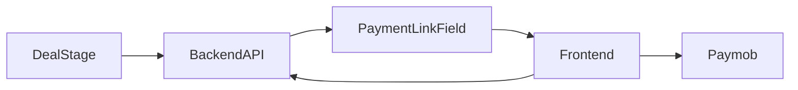

# Finance Automation System

Middleware integrating **Bitrix24 CRM**, **Paymob**, and **Zoho Books**, split for Railway into two services:

| Service | Folder | Role |
|---------|--------|------|
| **Backend API** | [`backend/`](backend/) | Webhooks, sessions, Bitrix/Paymob/Zoho — **Bitrix Handler URL** |
| **Frontend** | [`frontend/`](frontend/) | Customer `/payment/{token}` T&C pages |

See [`RAILWAY.md`](RAILWAY.md) for deploy steps.

## Workflow Overview

1. Finance deal enters **Payment Request** stage → Bitrix **outbound webhook** hits the **API** (`/webhooks/bitrix24`).
2. API generates a token, writes the link into Bitrix **Payment Link** field (frontend URL), Bitrix emails the customer.
3. Customer opens `/payment/{token}` on the **frontend**, accepts T&C, frontend calls API, redirects to Paymob.
4. First payment creates Sales / Finance / B2C deals + Zoho invoice; later payments update the same invoice.



## Quick Start (local)

```powershell
python -m venv .venv
.\.venv\Scripts\activate
pip install -r backend\requirements.txt
pip install -r frontend\requirements.txt
copy .env.example .env

# Migrations
cd backend
$env:PYTHONPATH="."
..\..\.venv\Scripts\python.exe -m alembic upgrade head
cd ..

# Terminal 1 — API (Bitrix uses this once public)
$env:PYTHONPATH="backend"
.venv\Scripts\python.exe -m uvicorn app.main:app --app-dir backend --host 127.0.0.1 --port 8001

# Terminal 2 — Frontend (customer links)
$env:PYTHONPATH="frontend"
.venv\Scripts\python.exe -m uvicorn app.main:app --app-dir frontend --host 127.0.0.1 --port 3000
```

Or: `.\start.ps1`

- API health: `http://localhost:8001/health`
- Frontend health: `http://localhost:3000/health`

## Important URLs

| Use | URL |
|-----|-----|
| Bitrix outbound Handler | `https://<API>/webhooks/bitrix24` |
| Customer payment link | `https://<FRONTEND>/payment/{token}` |
| Paymob notification | `https://<API>/webhooks/paymob` |

## API Endpoints (backend)

| Method | Path | Purpose |
|--------|------|---------|
| GET | `/health` | Health check |
| POST | `/webhooks/bitrix24` | Lead / finance deal stage |
| POST | `/webhooks/paymob` | Paymob callback |
| GET | `/api/payment/{token}` | Terms payload for frontend |
| POST | `/api/payment/{token}/accept` | Accept T&C → `{ checkout_url }` |
| POST | `/api/dev/send-payment-link` | Dev: create link |
| POST | `/api/dev/simulate-paymob-webhook` | Dev: simulate payment |

## Tests

```bash
cd backend
$env:PYTHONPATH="."
..\..\..\.venv\Scripts\python.exe -m pytest
# from repo root:
$env:PYTHONPATH="backend"
.venv\Scripts\python.exe -m pytest
```

## Manual Bitrix Setup

1. Outbound webhook on Payment Request stage → **API** `/webhooks/bitrix24` (not frontend).
2. After link is written to `UF_CRM_…` Payment Link, add Bitrix **Send email** with that field.
3. Set `PUBLIC_BASE_URL` (API) and `PAYMENT_FRONTEND_BASE_URL` (frontend) in production env.
