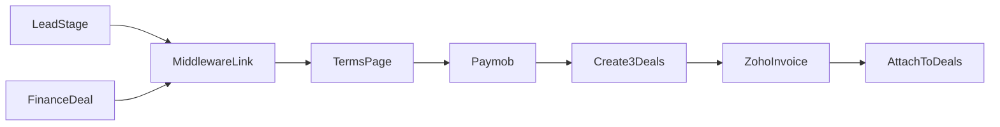

# Finance Automation System

Prototype middleware integrating **Bitrix24 CRM**, **Paymob**, and **Zoho Books** for a complete finance collection workflow.

## Workflow Overview

1. Customer exists as a **Lead** in Bitrix24.
2. When the Lead enters the payment stage, the middleware generates a **secure payment token** and emails a middleware URL (`/payment/{token}`) — never the raw Paymob URL.
3. Customer reviews **Terms and Conditions only** (no pricing, invoice, or personal data on the page), accepts, receives a PDF copy by email, and is redirected to Paymob.
4. On **first successful payment**, the middleware creates three independent deals: **Sales**, **Finance**, and **B2C**.
5. **Zoho Books** creates an invoice on first payment; subsequent payments update the **same invoice**.
6. The latest invoice is attached/referenced on all three deals and emailed to the customer.
7. **Subsequent payments** are initiated from the Finance Deal (stage or "Send Payment Link" button), repeating the full T&C → Paymob → invoice update flow.



## Tech Stack

- Python 3.11, FastAPI, SQLAlchemy, Alembic
- PostgreSQL
- Jinja2 (T&C page), ReportLab (PDF)
- Mock integrations by default (`USE_MOCK_INTEGRATIONS=true`)

## Quick Start

### 1. Start PostgreSQL

```bash
docker compose up -d
```

### 2. Configure environment

```bash
copy .env.example .env
```

### 3. Install dependencies

```bash
python -m venv .venv
.venv\Scripts\activate
pip install -r requirements.txt
```

### 4. Run migrations

```bash
alembic upgrade head
```

### 5. Start the API

```bash
uvicorn app.main:app --reload
```

Health check: `GET http://localhost:8000/health`

## API Endpoints

| Method | Path | Purpose |
|--------|------|---------|
| GET | `/health` | Health check |
| POST | `/webhooks/bitrix24` | Lead stage + Finance deal stage/button |
| POST | `/webhooks/paymob` | Paymob payment callback |
| GET | `/payment/{token}` | T&C landing page |
| POST | `/payment/{token}/accept` | Accept T&C, redirect to Paymob |
| POST | `/api/dev/send-payment-link` | Dev: trigger payment link |
| POST | `/api/dev/simulate-paymob-webhook` | Dev: simulate payment |

## End-to-End Prototype Test

```bash
# 1. Create payment link from lead
curl -X POST http://localhost:8000/api/dev/send-payment-link \
  -H "Content-Type: application/json" \
  -d "{\"lead_id\": 1001, \"customer_email\": \"customer@example.com\", \"total_amount\": \"10000\"}"

# 2. Open payment_url in browser, accept T&C

# 3. Simulate Paymob payment (use merchant_reference from step 1)
curl -X POST http://localhost:8000/api/dev/simulate-paymob-webhook \
  -H "Content-Type: application/json" \
  -d "{\"merchant_reference\": \"WF-1-xxxxxxxx\", \"amount\": \"3000\"}"

# 4. Subsequent payment from finance deal (use finance_deal_id from step 3 response)
curl -X POST http://localhost:8000/api/dev/send-payment-link \
  -H "Content-Type: application/json" \
  -d "{\"finance_deal_id\": 9000021001}"
```

Mock emails are written to `storage/emails/`. Mock invoice PDFs are in `storage/pdfs/invoices/`.

## Integration Placeholders

All external integrations use **Protocol + Mock + Real stub** pattern in `app/integrations/`:

| Integration | Mock (default) | Real stub |
|-------------|----------------|-----------|
| Bitrix24 | `MockBitrixClient` | `RealBitrixClient` |
| Paymob | `MockPaymobClient` | `RealPaymobClient` |
| Zoho Books | `MockZohoBooksClient` | `RealZohoBooksClient` |
| Email | `MockEmailClient` | `RealEmailClient` |

Set `USE_MOCK_INTEGRATIONS=false` and configure credentials in `.env` to switch to real implementations.

## Manual Bitrix Setup (later)

1. Create Finance Deal pipeline with "Generate Payment Link" stage.
2. Configure Lead payment stage ID → `BITRIX_LEAD_PAYMENT_STAGE_ID`.
3. Wire outbound webhook / robot to `POST {PUBLIC_BASE_URL}/webhooks/bitrix24`.
4. Add custom "Send Payment Link" button on Finance Deal → same webhook with `action=send_payment_link`.

## Tests

```bash
pytest
```

## Manual Verification Checklist

- [ ] Lead payment stage triggers middleware link email (no Paymob URL in email)
- [ ] T&C page shows only terms — no customer/invoice/pricing data
- [ ] Cannot proceed without accepting checkbox
- [ ] T&C acceptance generates PDF and sends email
- [ ] First payment creates Sales + Finance + B2C deals
- [ ] Zoho invoice created on first payment
- [ ] Second payment updates same invoice ID
- [ ] Invoice attached to all three deals
- [ ] Invoice emailed to customer after each payment
- [ ] Finance deal "Send Payment Link" creates fresh session with new T&C flow
- [ ] Duplicate Paymob transaction IDs are ignored
