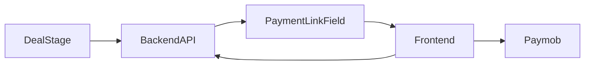

# Finance Automation System

Middleware integrating **Bitrix24 CRM**, **Paymob**, and **Zoho Books**, split for Railway:

| Service | Folder | Role |
|---------|--------|------|
| **Backend API** | [`backend/`](backend/) | Webhooks, sessions, Bitrix/Paymob/Zoho, Cash Desk APIs |
| **Frontend** | [`frontend/`](frontend/) | Customer `/payment/{token}` T&C pages |
| **Cash Desk** | [`cashdesk/`](cashdesk/) | Employee/manager cash collection UI (Next.js) |

See [`RAILWAY.md`](RAILWAY.md) for deploy steps.

## Workflow Overview

1. Lead enters payment stage → Bitrix webhook hits the **API** (`/webhooks/bitrix24`).
2. If next installment payment mode is **Cash** → item appears in Cash Desk queue (no Paymob link). Otherwise API generates a Paymob payment link.
3. Customer (online) opens `/payment/{token}` on the **frontend**, accepts T&C, redirects to Paymob.
4. Employee (cash) claims/collects in Cash Desk; deposits reduce cash on hand. Managers see ledger + balances.
5. First payment creates Sales / Finance / B2C deals + Zoho invoice; later payments update the same invoice.


```mermaid
flowchart LR
  BitrixStage[DealStage] --> ApiSvc[BackendAPI]
  ApiSvc --> BitrixField[PaymentLinkField]
  BitrixField --> FrontSvc[Frontend]
  FrontSvc --> ApiSvc
  FrontSvc --> Paymob[Paymob]
```

## Quick Start (local)

```powershell
python -m venv .venv
.\.venv\Scripts\activate
pip install -r backend\requirements.txt
pip install -r frontend\requirements.txt
copy .env.example .env

# Migrations
cd backend
$env:PYTHONPATH="."
..\..\.venv\Scripts\python.exe -m alembic upgrade head
cd ..

# Terminal 1 — API (Bitrix uses this once public)
$env:PYTHONPATH="backend"
.venv\Scripts\python.exe -m uvicorn app.main:app --app-dir backend --host 127.0.0.1 --port 8001

# Terminal 2 — Frontend (customer links)
$env:PYTHONPATH="frontend"
.venv\Scripts\python.exe -m uvicorn app.main:app --app-dir frontend --host 127.0.0.1 --port 3000

# Terminal 3 — Cash Desk (employees / managers)
cd cashdesk
copy .env.local.example .env.local
npm install
npm run dev -- -p 3001
```

Or: `.\start.ps1`

- API health: `http://localhost:8001/health`
- Frontend health: `http://localhost:3000/health`
- Cash Desk: `http://localhost:3001` (set `STAFF_JWT_SECRET` + bootstrap manager in `.env`)

## Important URLs

| Use | URL |
|-----|-----|
| Bitrix outbound Handler | `https://<API>/webhooks/bitrix24` |
| Customer payment link | `https://<FRONTEND>/payment/{token}` |
| Paymob notification | `https://<API>/webhooks/paymob` |
| Cash Desk UI | `https://<CASHDESK>/` |

## API Endpoints (backend)

| Method | Path | Purpose |
|--------|------|---------|
| GET | `/health` | Health check |
| POST | `/webhooks/bitrix24` | Lead / finance deal stage |
| POST | `/webhooks/paymob` | Paymob callback |
| GET | `/api/payment/{token}` | Terms payload for frontend |
| POST | `/api/payment/{token}/accept` | Accept T&C → `{ checkout_url }` |
| POST | `/api/staff/login` | Cash Desk login |
| GET | `/api/staff/me` | Current staff user |
| GET | `/api/staff/cash/queue` | Open / claimed cash collections |
| POST | `/api/staff/cash/{id}/claim` | Claim a cash case |
| POST | `/api/staff/cash/{id}/collect` | Record cash collected |
| POST | `/api/staff/cash/deposits` | Record a deposit |
| GET | `/api/staff/dashboard` | Manager KPIs |
| GET | `/api/staff/transactions` | Manager ledger (`channel=cash\|online\|all`) |
| GET/POST | `/api/staff/employees` | Manager employee list / create |
| POST | `/api/dev/send-payment-link` | Dev: create link |
| POST | `/api/dev/simulate-paymob-webhook` | Dev: simulate payment (pass `"success": false` to simulate a decline) |

### Simulating a failed payment

No need for a real Paymob decline card — `/api/dev/simulate-paymob-webhook` builds
a synthetic Paymob callback directly, so it works the same in mock or live mode:

```json
POST /api/dev/simulate-paymob-webhook
{ "token": "<payment session token>", "success": false, "decline_reason": "Insufficient Funds" }
```

This exercises the same code path as a real decline: a `❌ PAYMENT FAILED` timeline
comment on the lead/finance deal, plus a Bitrix chat + mail notification to the
lead owner (`BITRIX_NOTIFY_OWNER_ON_PAYMENT_FAILURE`). Omit `"success"` (or set it
to `true`) to simulate a normal successful payment instead.

## Tests

```bash
cd backend
$env:PYTHONPATH="."
..\..\..\.venv\Scripts\python.exe -m pytest
# from repo root:
$env:PYTHONPATH="backend"
.venv\Scripts\python.exe -m pytest
```

## Manual Bitrix Setup

1. Outbound webhook on Payment Request stage → **API** `/webhooks/bitrix24` (not frontend).
2. After link is written to `UF_CRM_…` Payment Link, add Bitrix **Send email** with that field.
3. Set `PUBLIC_BASE_URL` (API) and `PAYMENT_FRONTEND_BASE_URL` (frontend) in production env.
